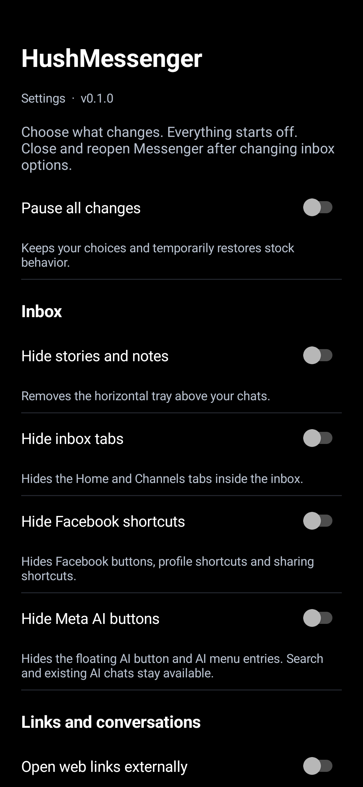
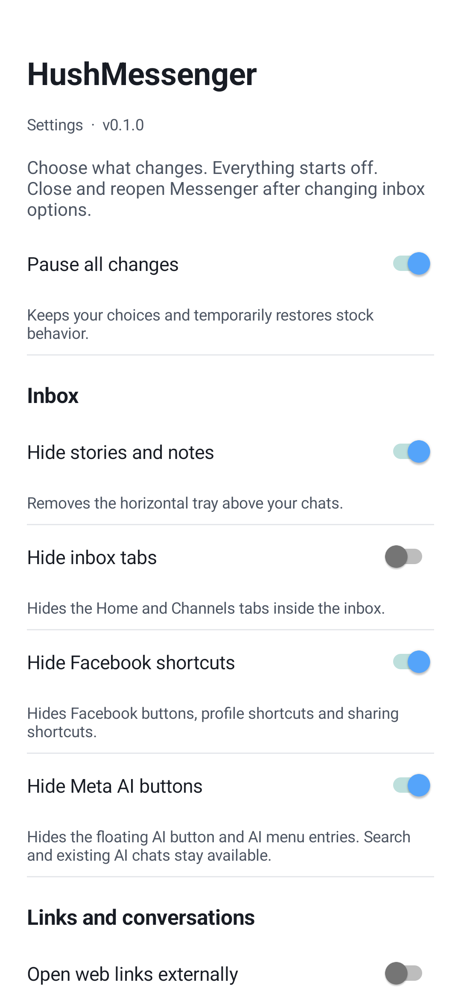

<p align="center">
  <a href="https://github.com/SysAdminDoc/HushMessenger/releases/tag/v0.1.0"></a>
  <a href="LICENSE"></a>
  
  
  
</p>

# HushMessenger

HushMessenger is a Morphe patch source for Facebook Messenger. It adds optional inbox, navigation and conversation controls, with a settings icon in your app drawer. You bring the original Messenger APK; this repository provides patch code and a `.mpp` bundle.

**[Add HushMessenger to Morphe Manager](https://morphe.software/add-source?github=SysAdminDoc%2FHushMessenger)**

> [!WARNING]
> **The re-signed app is not ready for daily use.** A patched Messenger installed on the S25 with the same key as its patched Facebook app, but its first-run screen stayed blank. An unchanged APK rebuilt and signed through Morphe did the same. Stock Messenger is restored and signed in. Its successful chat tests do not establish that a re-signed build works. Make sure you can sign in again and recover your encrypted chats before replacing an installed app. Keep your signing key and follow [Morphe's backup and keystore guide](https://github.com/MorpheApp/morphe-manager/blob/main/docs/backup-and-keystore.md).

## Get the preview

1. **Check the APK.** This patch targets two arm64 Messenger builds, with version codes `346013387` and `346013440`. The [supported builds](#supported-messenger-builds) have the full details. The version name alone isn't enough.
2. **Add the source.** Open the link above on Android with Morphe Manager installed. You can also open **Sources**, tap **+**, choose **Remote**, and enter `github.com/SysAdminDoc/HushMessenger`.
3. **Check the source.** The HushMessenger card should show two patches. Open **Patches** to find `Messenger controls and settings` and `Install beside Meta apps`. Select both for the full bundle. Tap the card's refresh button if it stays on an old version.
4. **Choose one source.** Use the remote or local HushMessenger source. Adding both creates two cards with the same name, which can point to different versions. If other sources offer Messenger patches, choose the one you intend; mixing independent patches can cause conflicts.

For a local source, download [`patches-0.1.0.mpp`](https://github.com/SysAdminDoc/HushMessenger/releases/tag/v0.1.0) and add it through **Sources → + → Local**. A local source won't update itself. The `.mpp` file is a patch bundle, not an installable Messenger APK. These source steps follow [Morphe's source guide](https://github.com/MorpheApp/morphe-manager/blob/main/docs/patch-sources.md). A clean Manager 1.32.0 profile imported both v0.0.4 source methods and listed the exact Messenger patch in an isolated Android emulator. The phone behavior warning above still applies.

### If something doesn't work

- **Patch missing:** Check the source card's **Patches** list, turn on **Pre-release patches**, then tap its refresh button.
- **APK rejected:** Use an unmodified arm64 Messenger 580.0.0.49.91 APK with version code `346013387` or `346013440`. If a permission or instruction check fails, the error names the tested builds.
- **Android rejects installation over stock Messenger:** A re-signed APK can't replace Meta's signed copy. Keep your local data intact while you plan a backup. Future updates of your patched copy must reuse your key; see [Morphe's keystore guide](https://github.com/MorpheApp/morphe-manager/blob/main/docs/backup-and-keystore.md).
- **Local source still old:** Download the latest `.mpp` and replace the local source yourself.

The S22's stock Messenger 580 has a **Hide suggestions** action in the `People you may know` menu. Its **Open links in external browser** switch under **Me → Photos & media** works for the HTTP and HTTPS links we tested in an encrypted chat. Off opened Messenger's browser; on opened Chrome. The original setting was restored afterward. Suggestion persistence, internal links and malicious-link warnings still need separate checks.

### Check a signed APK before installation

The repository includes a read-only certificate check. It uses Android's `apksigner` to verify the candidate and installed APKs, compares the complete signer sets for the phone's Android version, and checks who owns the candidate's declared permissions. Source-stamp certificates aren't treated as app signers. It also catches version downgrades.

Use Python 3.11 or newer, JDK 21, Android SDK Build Tools (tested with 36.1.0), and an authorized ADB connection. Run this from the repository with the phone's exact serial from `adb devices`:

```powershell
python scripts/check_install.py --apk .\messenger-signed.apk --serial YOUR_PHONE_SERIAL --build-tools "$env:LOCALAPPDATA\Android\Sdk\build-tools\36.1.0" --java "$env:JAVA_HOME\bin\java.exe"
```

Exit `0` means no certificate or downgrade conflict was found. Exit `1` reports a conflict; exit `2` means the check couldn't finish. Different current certificates aren't approved through a possible rotation lineage. The check reads user 0's installed base APKs into a temporary directory, then deletes those local copies. It doesn't install, uninstall, clear data or change phone settings.

A successful check doesn't establish cross-app login, provider access or Messenger startup. Run it before planning an installation, and keep the installed app's data intact when it reports a conflict. See [Android's signing tool reference](https://developer.android.com/tools/apksigner).

## Find the settings

After installing Messenger patched with **Messenger controls and settings**, open your phone's **app drawer → HushMessenger settings**. The gear icon opens the controls directly. Each switch starts off, and **Pause all changes** restores stock behavior without forgetting your choices. Close and reopen Messenger after changing inbox options.

| Switch | What it changes |
| --- | --- |
| Hide stories and notes | Hides the horizontal tray above chats. |
| Hide inbox tabs | Hides the Home and Channels subtabs. |
| Hide Facebook shortcuts | Removes Facebook toolbar, profile and sharing shortcuts. |
| Hide Meta AI buttons | Hides the floating button and AI menu entries. Search and existing AI conversations remain available. |
| Open web links externally | Uses the stock external-browser preference branch for HTTP and HTTPS. Other schemes keep their original behavior. |
| Hide typing indicator | Suppresses the outgoing active-typing runnable. Sending messages and read receipts are separate. |
| Allow chat bubbles | Removes Messenger's low-memory gate on Android 11 or newer. Android's notification and bubble permissions still apply. |

<p>
  
  
</p>

The settings screen also has a light theme and an **Open Messenger** button. Refreshing the source in Morphe downloads the patch bundle; applying new controls to Messenger requires rebuilding and installing its APK.

Ad blocking isn't included. The older upstream inbox ad loader is absent from both supported APKs. Media-transcoding changes also need a verified upload path. These are not advertised as working switches.

## What the patches change

### Messenger controls and settings

The bundle adapts existing GPL-3.0 Messenger hooks and adds reversible runtime switches. It checks all 31 expected methods before editing, then checks the precise tab and browser preference instructions. Missing or changed hooks stop the patch. The settings provider is private; its launcher activity accepts no commands to change preferences from another app.

### Install beside Meta apps

The patch renames Messenger's two shared Meta signature permissions in declarations, requests, guarded components and six DEX string loads. It stops if those sites differ from the tested APK. It doesn't address Messenger's other cross-app signer checks, so Facebook login and account switching remain on the [roadmap](ROADMAP.md).

Morphe groups these builds under one version name, so it may list the patch for another 580 APK. The patch checks the version code before changing anything and rejects builds other than `346013387` and `346013440`.

If you patch both Messenger and [Hushfacebook](https://github.com/SysAdminDoc/Hushfacebook), sign them with the **same key**. Android grants shared signature permissions only when the apps are signed alike.

## Supported Messenger builds

| Field | Value |
| --- | --- |
| Package | `com.facebook.orca` |
| Version | `580.0.0.49.91` |
| Version codes | `346013387` (S22), `346013440` (S25) |
| Architecture | `arm64-v8a` |
| Minimum Android version | Android 9 (API 28) |

SHA-256 of the stock base APKs used for the off-device checks:

```text
346013387  128ec75e836f24328d2b28777091c03b20abba0adc536e7ee911ee5fe52e70bc
346013440  e7d3c64227a7d9a26adda4e89321a87a49c85ee9e9f28f2fa7ed7fa79ae15cf6
```

On Windows, compare your file with `Get-FileHash -Algorithm SHA256 .\messenger.apk`. Meta can publish different APKs under one version name. If the hash differs, don't assume the off-device result applies to your file; the patch also checks its permission layout and instruction sites.

## Verification and build

Nineteen Kotlin tests cover the version-code gate, manifest guards, instruction changes and the settings launcher. Nine Android unit tests cover stock defaults, independent switches, pause, web schemes, bubble API limits saved settings and opening the correct Messenger task. Eleven Python tests cover certificate selection, permission ownership, failure handling and read-only device operations. Android lint and the release build run locally.

Morphe Desktop 1.17.0 applied both v0.1.0 patches to private copies of the S22 and S25 APKs. Both rebuilt successfully, and Android verified their v3 signatures. The changed-APK check in `scripts/verify_changed_apk_failure.py` confirms that altered permission bytecode stops patching before an output is written. It passed on both fixtures in earlier releases and was repeated on S25 for this release. Two clean v0.1.0 builds produced the same bundle checksum.

A separately installed diagnostic copy on S25 exercised the settings screen, saved switches, light theme and Open Messenger button. Stories and notes, the Facebook toolbar shortcut and the Meta AI floating button disappeared when enabled and returned when changes were paused. The test copy needed a private package-name adjustment and skipped encrypted-history restoration. It does not establish that an original-package installation works.

Typing suppression, inbox subtabs and bubble eligibility have automated coverage but still need full account-to-account or device behavior checks. The external-browser override has scheme and instruction checks; the stock switch passed HTTP/HTTPS phone checks. Full re-signed chat delivery, calls, notification behavior and history recovery remain unverified.

The restored stock apps on S22 and S25 exchanged messages between two owned accounts in an end-to-end encrypted chat. Both phones displayed the messages and read receipts. HTTP and HTTPS link tests on S22 confirmed the stock external-browser switch works. These checks used hidden virtual displays; installed packages and sign-ins were preserved. Re-signed chat delivery, calls and notification behavior remain unverified.

To inspect the source with Morphe Desktop 1.17.0, set `JAVA_HOME` to a JDK 21 or newer:

```powershell
& "$env:JAVA_HOME\bin\java.exe" -jar morphe-desktop-1.17.0-all.jar list-patches --patches https://github.com/SysAdminDoc/HushMessenger --filter-package-name com.facebook.orca
```

This command lists patches. Source updates and Messenger installation are separate steps.

To build the bundle on Windows, use JDK 21, Android SDK 36 and the Gradle wrapper. Set `ANDROID_HOME` to your SDK directory. The Morphe Gradle plugin needs GitHub Packages credentials:

```powershell
$env:GITHUB_ACTOR = gh api user --jq .login
$env:GITHUB_TOKEN = gh auth token
.\gradlew.bat :patches:clean :extensions:messenger:clean :patches:test :extensions:messenger:testDebugUnitTest :extensions:messenger:lintRelease :patches:buildAndroid --no-daemon
python -m unittest discover -s scripts/tests -v
```

The output is `patches/build/libs/patches-0.1.0.mpp`. Dependency locks and SHA-256 checks are committed. Review both when changing a dependency; clean builds from the same source produce the same bundle checksum.

### Check the bundle

The [v0.1.0 release](https://github.com/SysAdminDoc/HushMessenger/releases/tag/v0.1.0) includes a `SHA256SUMS.txt` file. Compare its `.mpp` hash with your download. You can also build the tagged source locally and compare the output. The checksum and bundle are hosted under the same GitHub account, so this check cannot independently rule out an account compromise.

```text
bedadfdf3076602197cb250ba5006bdbca9eca86f7725f712288e381d72811f8  patches-0.1.0.mpp
```

Morphe Manager 1.32.0 and Desktop 1.17.0 parse `signature_download_url` but do not verify a detached signature when importing patch bundles. An `.asc` link in the source index would not add automatic protection in those versions. Keep the source URL on the repository you trust, and review a new bundle before updating.

## Research and credits

[RESEARCH.md](RESEARCH.md) compares Messenger patches in Morphe, ReVanced, De-Vanced and other projects. [Roadmap_Blocked.md](Roadmap_Blocked.md) tracks the remaining phone checks, missing fixtures and proposed patches. [Hushfeed](https://github.com/SysAdminDoc/hushfeed) is another Hush patch project.

HushMessenger starts from the [Morphe patches template](https://github.com/MorpheApp/morphe-patches-template). Messenger hook definitions come from [De-Vanced](https://github.com/RookieEnough/De-Vanced), including its ReVanced contributions, and [Doom's patches](https://github.com/rushiranpise/morphe-patches). The bubble eligibility anchor originated in [ChatHeadEnabler](https://github.com/NeonOrbit/ChatHeadEnabler). The permission approach is adapted from [Hushfacebook's shared-permission patch](https://github.com/SysAdminDoc/Hushfacebook/blob/15b8e9ed9315464a3e2d1a821b4e26ad47bbc28c/patches/src/main/kotlin/app/morphe/patches/facebook/coexist/SharedPermissions.kt). Source is under [GPL-3.0](LICENSE); see [NOTICE](NOTICE). HushMessenger is independent of Meta and Morphe.

<p align="center">
  <a href="https://ko-fi.com/X8K126YVER"></a>
</p>
